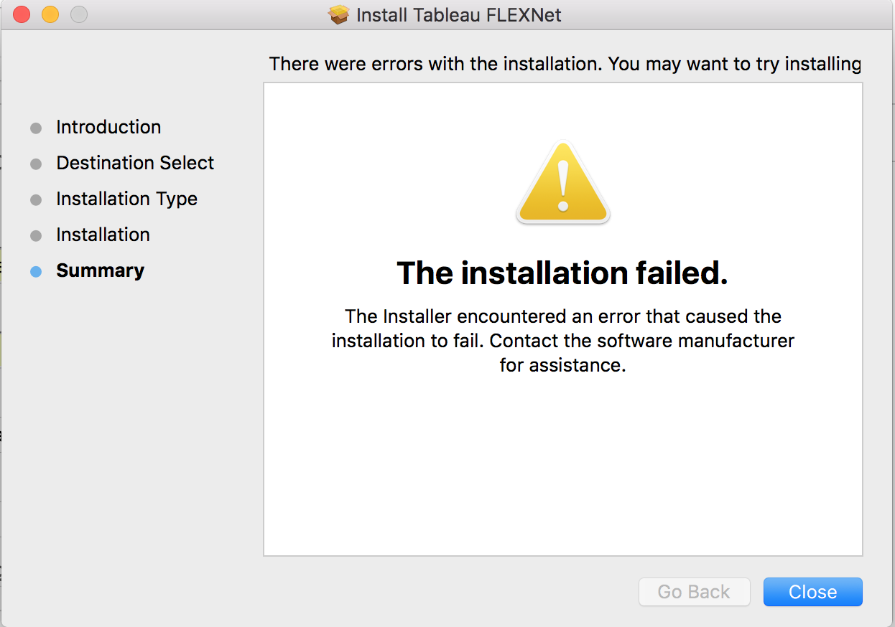
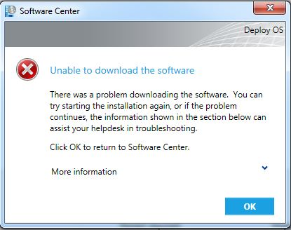
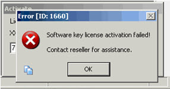
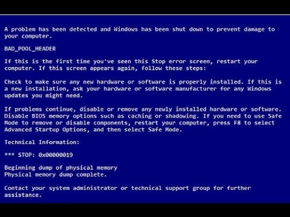
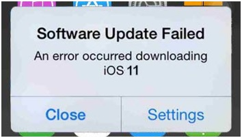

Overview of software learning tools
========================================================
author: Mark Hanly
date: Friday 15 February 2019
autosize: true

Let's face it. Software is scary.
========================================================

Thinking about the end point
========================================================

- Assignment
- Thesis
- Research report
- Presentation
- Academic paper
- Webpage/interactive tool

[Here's an example](https://www.mja.com.au/system/files/issues/202_11/sch00103.pdf)

Two software tasks
========================================================

## Statistical Analysis

- Excel/Numbers
- SPSS
- **SAS**
- Stata
- **R**
- **Python**

*** 

## Communicating Results
- Word/Pages
- **Jupyter Notebooks**
- **RMarkdown/knitr**

Two approaches to producing an output
========================================================

## The **Office** model

- Analyse data in Excel
- Create a graph
- Cut and paste the graph into Word
- Write your report in Word

*** 

## The **Plain Text** model

- 

Package wars
========================================================

Python
========================================================

- HDAT 9300 Principles of Programming
- HDAT 9500 Machine Learning and Data Mining

***

## Pros
- General purpose programming language
- Open source and free
- Widely used in many specialised areas
  - Machine learning 
  - Deep learning
  - Natural lanaguage processing 
- Many online resources

## Cons
- Immature 
 - Compatibility issues

SAS
========================================================
- HDAT 9400 Management and Curation of Health Data

***

## Pros
- Handles large datasets well
- Data management is easy and transparent
- Well documented
- Widely used in many industries
  - Government
  - Pharmaceuticals

## Cons
- Not open source
- Expensive
- Slow to integrate novel methods
- Clunky
- Sub-par graphics

R
========================================================
- HDAT 9200 Statistical Foundations of HDS
- HDAT 9600 Statistical Modelling I
- HDAT 9700 Statistical Modelling II
- HDAT 9800 Visualisation and Communication of Health Data

***

## Pros
- Open source
  - Free
  - Easy to implement new methods
  - Cutting edge  
- Huge amount of plug-in libraries for a variety of goals
- Excellent graphical capabilities

## Cons
- Poorly documented

Communicating Results
========================================================
- Rmarkdown/knitr
- jupyter Notebooks
- Shiny interactive web applications

Communicating Results
========================================================
- Rmarkdown/knitr
- jupyter Notebooks
- Shiny interactive web applications

Further reading
========================================================
